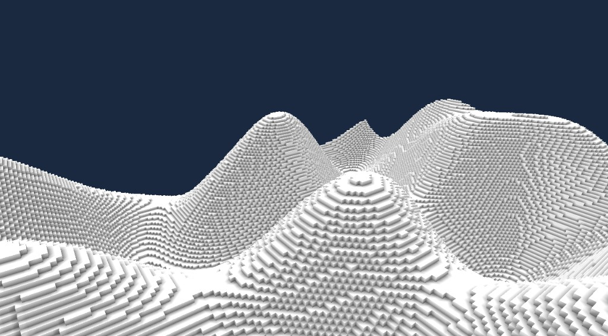

# Voxel Engine

Work-in-progress voxel terrain renderer built with `pygame`, `moderngl`, and `PyGLM`.

## Overview

This project is a voxel engine focused on procedural terrain, chunk-based meshes, and real-time OpenGL rendering. It generates a world, builds geometry from visible voxel faces only, and draws the result with a compact shader pipeline.

The project is still a `WIP`, but the main loop, chunk system, terrain generation, and hidden-face culling are implemented and working.

## Preview



## Current Features

- OpenGL 3.3 core profile rendering via `pygame` and `moderngl`
- Procedural voxel terrain generation
- Chunk-based world storage and mesh construction
- Hidden-face culling to limit unnecessary geometry
- First-person movement and mouse look
- Basic textured voxel shading

## Status

Under active development. Current priorities include terrain quality, rendering stability, and shading/texture.

## Requirements

- Python 3.10+
- A GPU and drivers with OpenGL 3.3 support

Install dependencies:

```bash
pip install -r requirements.txt
```

## Run

```bash
python main.py
```

## Controls

- `W A S D`: move horizontally
- `Q` / `E`: move vertically
- Mouse: look around
- `Esc`: exit

## Project Structure

- `main.py`: window, OpenGL context, and main loop
- `scene.py`: top-level scene wrapper
- `world.py`: chunk management and world rendering
- `world_objects/chunk.py`: chunk transform, voxel data, and mesh ownership
- `meshes/chunk_mesh_builder.py`: builds mesh data from visible voxel faces
- `meshes/chunk_mesh.py`: uploads chunk mesh data to the GPU
- `meshes/base_mesh.py`: shared mesh and VAO handling
- `camera.py`: camera math and view updates
- `player.py`: movement and input handling
- `shader_program.py`: shader loading and uniform updates
- `textures.py`: texture loading and binding
- `shaders/`: GLSL shader sources
- `assets/`: textures and preview images

## Notes

- Empty chunks are skipped so the renderer avoids creating empty GPU buffers.
- Faces between adjacent solid voxels are culled to reduce mesh size and overdraw.
- Terrain generation is procedural and currently implemented in `world_objects/chunk.py`.

