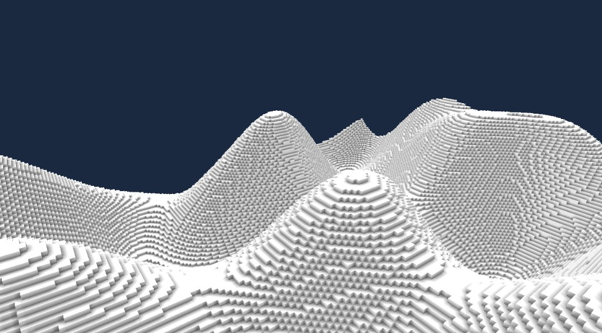

# Voxel Engine

A Minecraft-style voxel engine built from scratch with `pygame`, `moderngl`, and `PyGLM` - no game engine underneath, just raw OpenGL 3.3.

## Overview

An infinite, streamed voxel world with real per-block textures, block breaking/placing, a survival-style inventory and crafting, day/night lighting with torches, oceans you can swim in, and mobs that wander or chase you down. Everything is procedurally generated from a world seed and persists between runs.

## Preview



*(preview image predates the texture/lighting/water passes - the game looks a fair bit different now)*

## Features

- **Infinite world** — chunks stream in and out around the player instead of a fixed-size map, height capped at 96 blocks like vanilla
- **Terrain** — multi-octave heightmaps for real hills, winding caves, clustered coal/iron veins, sand beaches, oceans/lakes at sea level
- **Textures** — a self-authored procedural tile atlas, real per-face texturing (grass top/side/bottom, log rings, planks, ore, glass, water)
- **Block breaking & placing** — DDA raycast selection with a Minecraft-style outline, right-click places on the targeted face
- **Inventory** — 36-slot inventory (hotbar + 3x9 grid), stacking up to 64, break to collect, place to consume, drag-and-drop with `E`
- **Crafting** — 2x2 personal crafting grid: logs → planks, planks → a table, coal + plank → torches
- **Lighting** — real block light (BFS flood fill from torches) and column-based sky light, blended dynamically with a day/night cycle on a 20-minute clock
- **Water** — real alpha transparency, doesn't cull neighboring opaque faces, swimming physics (buoyancy, sink cap, swim-up)
- **Mobs** — passive mobs wander by day, hostile mobs spawn at night and chase/attack; player has health, combat, and respawn
- **Save/load** — worlds are seeded and persist: block edits, inventory, and player state save to disk and reload
- **Meshing** — Numba-accelerated, packed-vertex mesh builder with ambient occlusion, cross-chunk face culling, and a separate transparent pass for water/glass

## Requirements

- Python 3.10+
- GPU with OpenGL 3.3 support

## Setup

```bash
python -m venv venv
source venv/bin/activate   # Windows: venv\Scripts\activate
pip install -r requirements.txt
```

## Run

```bash
python main.py
```

## Controls

| Input | Action |
|-------|--------|
| `W` `A` `S` `D` | Walk |
| `Shift` | Run |
| `Space` | Jump (swim up while in water) |
| Mouse | Look around |
| Left click | Break block / attack a nearby mob |
| Right click | Place the selected hotbar block |
| `1`-`9` / scroll wheel | Select hotbar slot |
| `E` | Open/close inventory |
| `Esc` | Exit |

## Project Structure

```
main.py                  Entry point, window, and game loop
scene.py                 Scene wrapper around the world
world.py                 Chunk streaming, voxel/light read-write, collision, mob spawning
world_gen.py             Terrain height, caves, ore veins, sea level
world_objects/chunk.py     Per-chunk voxel/light generation and mesh ownership
blocks.py                Block registry: textures, solidity, light level
inventory.py             Item stacks and the 36-slot inventory
crafting.py               Recipe matching and ingredient consumption
lighting.py               Day/night clock, sky color, block-light BFS, sky light
save.py                   World seed, edits, and player state persistence
player.py                Movement, physics, swimming, health, camera input
camera.py                View/projection math
voxel_handler.py         Raycast, block selection/placement, mob attacks
hud.py                    Hotbar, crosshair, inventory screen, crafting UI, health
entities/
  entity.py                Base physics (gravity, collision) for mobs
  mob.py                    Mob stats and state
  ai.py                     Wander/chase/attack behavior
meshes/
  chunk_mesh_builder.py  Face culling, AO, lighting, mesh generation (Numba)
  chunk_mesh.py          GPU upload for chunk meshes (opaque + water buffers)
  cube_mesh.py           Shared cube geometry for mob rendering
  hud_mesh.py            Full-screen quad for the 2D HUD overlay
  selection_outline.py   Minecraft-style block highlight wireframe
  base_mesh.py           Shared VAO/VBO handling
shader_program.py        Shader loading and uniforms
textures.py              Atlas texture loading and binding
shaders/                 GLSL vertex and fragment shaders (chunk, hud, quad)
assets/
  generate_textures.py    One-off script that generates the texture atlas
  atlas.png                The generated tile atlas
settings.py              World, player, and rendering constants
tests/                   pytest suite for the non-rendering logic
```

## How It Works

**Terrain generation** — Each chunk column stacks a few octaves of simplex noise for hills, carves cheap winding caves per-column (not full 3D noise - too slow to generate live while streaming), and drops ore in small clustered pockets using coarse, cached noise sampling. Everything is a pure function of world coordinates plus a per-world seed, so nothing needs to be stored except player edits.

**Chunk streaming** — Chunks are stored in a dict keyed by coordinate instead of a fixed array, loaded/unloaded around the player each frame within a render distance. Cross-chunk face culling works off a small 3x3x3 stack of neighboring chunks gathered fresh per mesh rebuild.

**Meshing** — Only exposed faces are emitted, split into two buffers per chunk: opaque and water/glass. Ambient occlusion and lighting are computed per face and packed into two `uint32` words per vertex (position/block/face/AO in the first, sky and block light in the second), so animating time-of-day never requires rebuilding a mesh.

**Lighting** — Sky light is column-based: open to the sky is lit, anything below the generated surface starts dark. Block light from torches is a real BFS flood fill, since it's what actually matters for how a placed torch looks - it only recomputes on edits near a light source, not every frame.

**Breaking & placing** — A DDA raycast finds the targeted block and which face was hit. Breaking removes the voxel and adds it to your inventory; placing consumes one from the selected stack and drops it on the hit face, blocked from placing inside your own hitbox.

**Save/load** — Since terrain is fully seed-derived, only edits away from the generated shape need to persist. `saves/world.json` stores the seed, a sparse `(x,y,z) -> block` edit map, inventory contents, and player state.

## Testing

```bash
pytest
```

Covers the non-rendering logic: raycasting, chunk streaming/neighbor math, terrain generation, save/load round-trips, inventory, crafting, lighting, and mob AI. Rendering and gameplay feel are verified by actually running the game - there's no automated test for what a torch looks like.

## Notes

- Player settings (speed, gravity, sensitivity, resolution) live in `settings.py`.
- All textures are procedurally generated by `assets/generate_textures.py`, not copied from Minecraft.
- The window is sized to fill most of a typical screen and centers itself on launch.

## Status

Actively developed. Not yet implemented: tools/durability (mining speed isn't gated by held item), a 3x3 crafting table tier, multiplayer, and sound.
